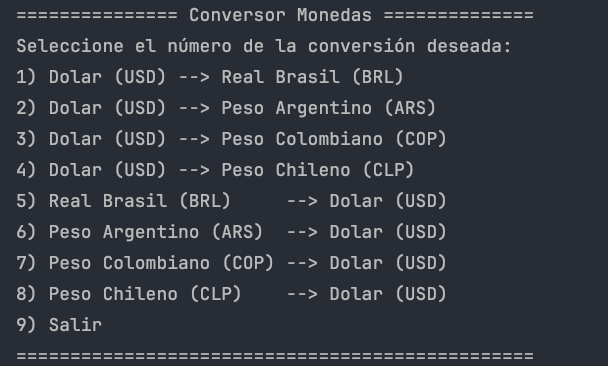
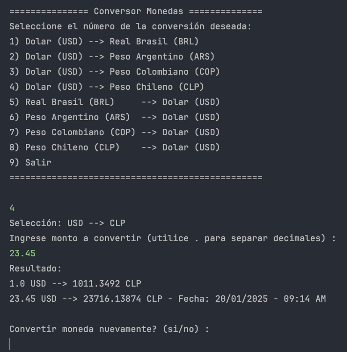
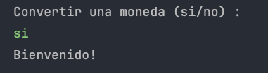
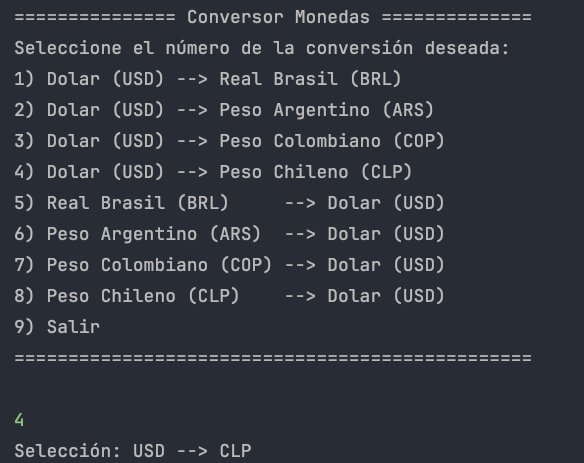
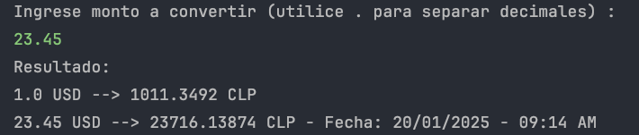
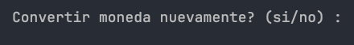

<h1 align="center">Challenge Conversor de Monedas</h1>

# ¡Bienvenido a mi proyecto en Oracle Next Education!
 

---

## Índice

* [Descripción](#descripcion)

* [Objetivos](#objetivos)

* [Estado del proyecto](#estado)

* [Cómo usar](#uso)

* [Tecnologías utilizadas](#tecnologias)

* [Autor](#autor)

* [Licencia](#licencia)

---

<h2 id="descripcion">Descripción:</h2>
Challenge Conversor de Monedas es un proyecto desarrollado para el programa ONE (Oracle Next Education), como parte de la formación de Alura Latam.

Corresponde a una aplicación con interfaz de línea de comando que puede ser ejecutada desde cualquier terminal de comando de Windows, Linux o Mac OS.

Su función es ayudar al usuario con la conversión de una cantidad de dinero de una moneda a otra moneda (por ejemplo de dolares USD a pesos chilenos CLP).

Las monedas seleccionadas para este ejercicio son:

- Dolar americano (USD)
- Peso chileno (CLP)
- Peso Argentino (ARS)
- Peso Colombiano (COP)
- Real Brasil (BRL)

---
<h2 id="objetivos">Objetivos y funcionalidad del proyecto:</h2>

El usuario debe ser capaz de seleccionar una de las 8 opciones disponibles de conversión ingresando el número inicial de la opción. Luego debe ser capaz de ingresar un monto de dinero para ser convertido según su elección previa. Finalmente debe presentarse el valor final, incluyendo la fecha y hora de consulta.

---
<h2 id="estado">Estado del proyecto:</h2>
<h4>Completado ✅</h4>

---
<h2 id="uso">Cómo usar:</h2>

1. Al iniciar, la aplicación le preguntará si desea hacer una conversión. El usuario debe ingresar si o no según corresponda.
   

2. Debe seleccionar una de las 8 opciones de conversión ingresando el número de la opción.

3. Luego debe ingresar el monto de dinero que quiere convertir, separando los decimales con un punto.

4. La aplicación devolverá el valor de cambio según lo seleccionado, junto con la fecha y la hora.

4. Finalmente, la aplicación volverá a preguntar si desea hacer una conversión nuevamente.
   

---
<h2 id="tecnologias">Tecnologías utilizadas:</h2>

* Git/GitHub  

* IntelliJ IDEA 

* Markdown 

---

<h2 id="autor">Autor:</h2>
Nicolás Rodrigo

---

<h2 id="licencia">Licencia:</h2>
Challenge Conversor de Monedas es MIT Licensed.